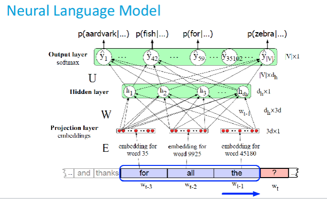

# Simple Language Model


A minimal feed‑forward neural language model built with **PyTorch**. It takes a fixed‑length context window of 5 BERT token IDs and predicts the next token. Using a tinyshakespeare.txt dataset

---

## ✨ Key points

* **Tiny architecture** `Embedding → Average → FC → ReLU → FC` (≈ 300 k trainable parameters)
* **CSV data pipeline** context + target stored as rows: `tok1,tok2,tok3,tok4,tok5,target`
* **Trainer class** handles dataloader, loss, optimizer, checkpointing
* Works with any text after tokenising by *bert‑base‑uncased* tokenizer

---

## 🔧 Requirements

| Package | Version |
|---------|---------|
| Python  | ≥ 3.9   |
| PyTorch | ≥ 1.13 or 2.x |
| transformers | ≥ 4.40 |

Install dependencies:
```bash
pip install torch transformers tqdm
